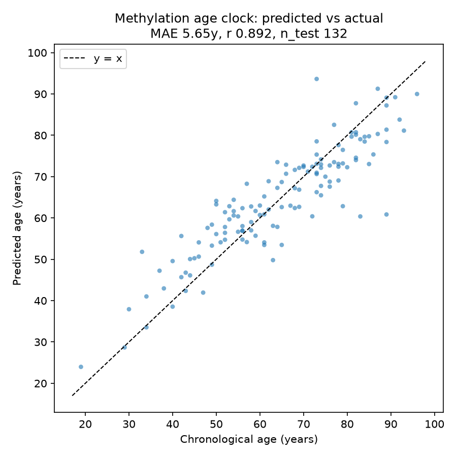

# Aging Clock: a DNA methylation biological-age predictor

Reads a blood sample's DNA methylation pattern and estimates a person's age, then
treats the gap between estimated and actual age as a biological-age signal. Same
modeling family as the first-generation epigenetic clocks (Hannum 2013, Horvath 2013).

Version 1.0.0

## The result

On held-out blood samples the model never saw during training, it predicts age to
within **5.65 years** on average (Pearson correlation r = 0.892). Applied unchanged
to a completely separate 689-person study, accuracy holds at **6.36 years**, the
honest cross-study number most portfolio clocks never report. It does this with a
sparse **176-site signature** it selected itself, and those sites overlap the
established Hannum aging-clock sites far more than chance would allow (hypergeometric
test, p = 2.7e-06), evidence the model recovered real age biology rather than noise.

## In plain English

If you are not from biology or machine learning, here is the whole idea in five
short steps. Every technical word is defined the first time it appears.

**1. Two kinds of age.** Your *chronological age* is just your birthdays. Your
*biological age* is how old your body looks at the molecular level, which can run
ahead of or behind the calendar depending on genetics, health, and lifestyle.
Biological age is the quantity longevity research actually cares about, because it
is the thing a treatment might be able to change.

**2. The molecular clock.** Your DNA carries small chemical tags called *methylation*
marks. They sit at specific spots on the genome called *CpG sites* (just a place
where the DNA letters C and G sit next to each other). The pattern of these tags
shifts in a predictable way as you get older. "Epigenetic" simply means these tags
sit on top of the DNA and change over life without changing the underlying genetic
code.

**3. What this project builds.** A model that reads the methylation pattern from a
blood sample and estimates the person's age from it. Think of it as learning to
guess someone's age from a molecular fingerprint instead of their face.

**4. How it learns.** It is trained on 656 people whose real ages are known. It
learns which CpG sites matter and how to weigh them. Then, crucially, it is tested
on a separate group of people it never saw during training (*held-out* data). Being
off by only 5.65 years on strangers is what makes the result trustworthy rather than
memorization.

**5. The aging signal.** The model's miss on any one person, predicted age minus
actual age, is called the *residual*. If your methylome looks older than your
birthday says, the residual is positive, which is the basis for an "age
acceleration" estimate that longevity studies use to ask whether an intervention is
slowing aging.

What this is **not**: it is not a clinical test, it cannot tell an individual how
fast they will age, and a CpG site being predictive does not mean it causes aging.
This is a portfolio and learning project on public data.

## How it works (technical)

1. Download GSE40279 (Hannum 2013), parse the beta-value matrix plus per-sample age
   and sex.
2. Keep the top-variance CpG probes (default 20,000) with an unsupervised filter, so
   no age labels leak into the test set.
3. 80/20 train/test split with a fixed seed; standardize features on the training
   fold only.
4. Fit ElasticNetCV. Elastic net is a penalized regression that handles thousands of
   correlated probes (more features than samples) and selects a sparse signature,
   which is exactly how the published clocks were built.
5. Evaluate on the held-out set: MAE (years), RMSE, Pearson r.
6. Freeze the model and validate on an independent cohort (GSE42861) to get the
   honest cross-study error.
7. Test whether the selected CpGs overlap the known Hannum clock sites with a
   hypergeometric enrichment test.

## What is in this repo

    download_data.py     fetches and variance-filters the methylation matrix
    src/                 preprocessing, training, evaluation, enrichment, plots
    run_pipeline.py      one command that reproduces every result and figure
    results/             metrics.json, predictions.csv, and the figures
    reports/             methods writeup and model card
    data/                empty by design; the fetch script regenerates it

No data is committed. The matrix is large (656 samples by ~473,000 probes) and is
regenerated from the accession, which is standard practice and keeps the repo small.

## Reproduce

    python -m venv .venv
    .venv\Scripts\python.exe -m pip install -r requirements.txt
    .venv\Scripts\python.exe run_pipeline.py

First run downloads and filters the data, then trains, evaluates, validates, and
writes every figure. Reruns skip the download.

## Limitations

Blood only, one tissue. The training cohort is ancestry-skewed, so the clock is not
demographically general. First-generation clocks tend to over-predict the young and
under-predict the old, so the raw residual is an age-acceleration estimate only after
that bias is accounted for. The selected CpGs are statistical predictors, not proven
drivers of aging; a separate pathway-enrichment test returned no significant terms at
5 percent FDR, which is consistent with that caution and is reported rather than
hidden. Not a clinical or diagnostic tool.

## Glossary

- **Chronological vs biological age**: birthdays vs how old your body looks
  molecularly.
- **DNA methylation**: reversible chemical tags on DNA that shift with age.
- **CpG site**: a specific genomic spot where the tags are measured.
- **Epigenetic**: sitting on top of the DNA, changeable over life, not the genetic
  code itself.
- **Held-out / cross-validation**: testing on data the model never trained on, so the
  score reflects real prediction, not memory.
- **MAE (mean absolute error)**: average miss, in years here. Lower is better.
- **Pearson r**: correlation from -1 to 1; 0.892 means predicted and actual age move
  closely together.
- **Residual**: predicted minus actual; the basis for the age-acceleration signal.
- **Elastic net**: a regression that both handles many correlated inputs and keeps
  only the useful ones.
- **Hypergeometric test**: checks whether an overlap (here, with Hannum's sites) is
  bigger than chance.

## Citation and disclaimer

Method lineage: Hannum et al., Mol Cell 2013; Horvath, Genome Biol 2013. Data:
GSE40279 (train), GSE42861 (validation). Research and portfolio project, not a
clinical tool.
